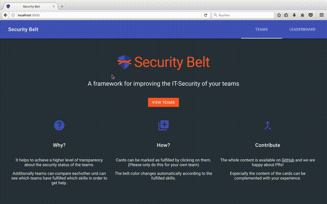

#  Security Belt

[](https://travis-ci.org/philippnormann/security-belt)
[](https://david-dm.org/philippnormann/security-belt)
[](https://david-dm.org/philippnormann/security-belt?type=dev)
[](https://security-belt.herokuapp.com/)

A framework for improving the IT-Security of your teams through gamification.
It allows teams to self-asses their security level and rewards them with security belts (from yellow through black) and topic specific badges. It also ranks the teams by the amount of aquired skills.


### [**View demo!**](https://security-belt.herokuapp.com/)

## Usage

### Cloning
```bash
git clone https://github.com/philippnormann/security-belt.git
cd security-belt
```
### Prerequisites
A mongoDB for storing the progress of the teams is required. The database is automatically seeded once the app is running.

### Docker-Compose
The included docker-compose file can be used to launch a mongoDB and a node container running the belt application. It also mounts the `./data/db` folder as a volume for the database.
```
docker-compose build
docker-compose up
```
### Development Setup
For development purposes a mongoDB container can be started without a volume:
```bash
docker run -d --name belt-mongo -p 27017:27017 mongo
```
This is better suited for development since the app container doesn't have to be rebuilt after every change.

Afterwards you can launch the application:
```bash
npm install
npm start
```
Optionally a webpack watcher can be launched in a seperate shell to dynamically recompile the client assets:
```bash
npm build:dev
```

### Testing
All the tests for the application can be executed using the test target:
```bash
npm test
```


## Environment Variables

### Logging

- `SB_LOG_LEVEL` one of `debug`, `info` (default), `warn`, `error`
- `SB_LOG_FILE` if set, will log to the given file (disabled by default)

### Application port:
- `PORT`, defaults to 3000

### Databse connection:
- `DB_USER`
- `DB_PASS`
- `DB_NAME`
- `DB_COLLECTION`
- `DB_HOST`

### HTTPS redirect:
- `NODE_ENV` = `production`, to enable HTTPS redirect.

## Teams
A team needs to have a security champion. A person from the team who is interested in security and wants to track the current security status of the team regularly. This person also coordinates the tasks that need to be done, in order to advance.

The team names and security champions are stored in a config file (`config/teams.json`)

You need to edit this file accordingly.

A valid team file should look like this:

```json
{
  "teams": [
    {
      "name": "Team 1",
      "champion": {
        "name": "Chuck Norris",
        "email": "chuck.norris@example.com"
      }
    }
  ]
}
```


## Skills
All the skills are sorted by colors and written in `.yml` files. (`config/skills`)

It helps to organize a workshop with the security chapions, in order to define a set of skills that make sense in your enviroment.

Please complement the skills and send pull requests.

A valid skill file should look like this:

```yaml
title: A nice title shown in the card
why: Why is this skill useful?
how: How can we reach this goal?
validation: How can we tell we reached the goal?
links:
  - Example: https://example.com
  - Some link in Confluence: https://confluence/?id=234
```

### Badges

You can enable badges by adding `.yaml` files in the folder `config/badges`.

The badges serve as a further motivation and relate to different skills that have been achieved.

```yaml
title: Always up to date
description: Your dependencies and software is always up to date.
requiredSkills:
  - dependency_checks
  - software_updates
```

### Lint the skills

To check if all skills are valid YAML syntax, you can use the included lint target:
```bash
npm run lint:yaml
```

## REST API

### GET `/api/stats?days=[n]`
Get skill progress for all teams over the last n days

Response:

- `x`: Unix epoch timestamp in seconds
- `y`: Total number of completed skills at date `x`

```json
{
  "progress": [
    {
      "x": 1497435199,
      "y": 172
    },
    {
      "x": 1497521599,
      "y": 175
    },
    {
      "x": 1497607999,
      "y": 194
    }
  ]
}
```

### GET `/api/stats/[teamName]?days=[n]`
Get skill progress for a specific team over the last n days

Response:

- `x`: Unix epoch timestamp in seconds
- `y`: Total number of completed skills at date `x`

```json
{
  "progress": [
    {
      "x": 1497435199,
      "y": 30
    },
    {
      "x": 1497521599,
      "y": 34
    },
    {
      "x": 1497607999,
      "y": 38
    }
  ]
}
```

### GET `/api/teams`
Get all teams including their belt and skills

Response:

```json
{
  "teams": [
    {
      "name": "Team Awesome",
      "belt": "white",
      "skills": [
        {
          "name": "secure_sauce",
          "since": 1498747187
         }
      ],
      "skillCount": 1
    }
  ]
}
```

## Contribution

Contributions are always welcome!

Especially the content of the skills should be complemented with your experience.
